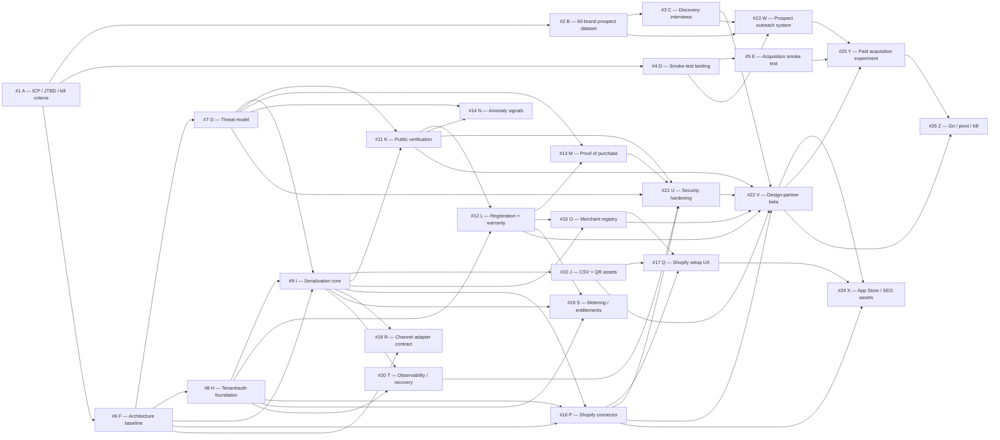

# PERT — Product Identity

Product Identity is managed as a dependency-driven program. Market validation runs in parallel with foundational engineering; expansion features are explicitly gated by evidence.

## Network

## Critical path

The principal delivery path is:

**#1 A → #2 B → #3 C → #6 F → #8 H → #9 I → #11 K → #12 L → #16 P → #21 U → #22 V → #26 Z**

The precise critical path may move as estimates are refined, but no roadmap expansion may bypass the validation gates.

## Parallel tracks

**Demand:** #1 → #2 → #3, with #4 → #5 running as a parallel landing/acquisition test.

**Trust:** #6 → #7 → #11/#12/#13/#16 → #21.

**Distribution:** #16 → #17 → #24, with #23 building founder-led prospecting from discovery evidence.

**Economics:** #19 establishes metering; #22 supplies real usage/support evidence; #25 measures paid acquisition; #26 makes the commercial decision.

## Gate policy

- No RMA/helpdesk expansion before #22/#26 evidence.
- No Amazon connector before Shopify pilot evidence.
- No DPP/compliance claims without a separate legal/compliance workstream.
- No paid scale campaign before activation and retention are measurable.
- Negative market evidence can stop or reshape the technical critical path.
